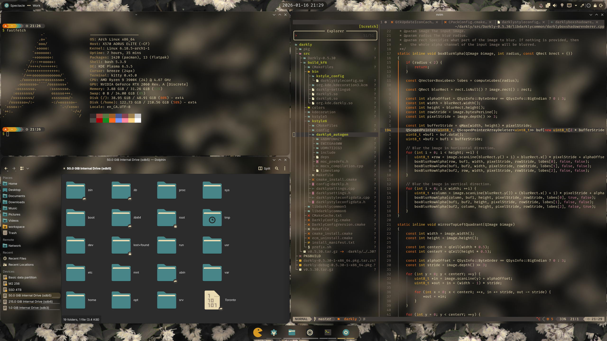
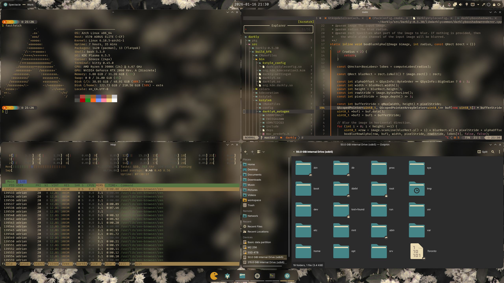

# dotfiles

Bare git repo for dotfiles management across Arch Linux and Windows.

## Setup on a new machine
```bash
# Clone the bare repo
git clone --separate-git-dir=$HOME/.dotfiles https://github.com/adrianveen/dotfiles.git tmpdotfiles

# Copy files (handles conflicts with existing configs)
rsync --recursive --verbose --exclude '.git' tmpdotfiles/ $HOME/
rm -rf tmpdotfiles

# Set up alias and config
alias dotfiles='git --git-dir=$HOME/.dotfiles/ --work-tree=$HOME'
dotfiles config --local status.showUntrackedFiles no
```

## Usage
```bash
dotfiles status          # Check what's changed
dotfiles add <file>      # Track a new file
dotfiles commit -m "msg" # Commit changes
dotfiles push            # Push to remote
```

## Screenshots
> *Current setup on Arch Linux*






## Contents

### Linux (Arch/KDE/Hyprland)
**Window Management & Desktop**
- `.config/hypr/` - Hyprland configuration (**Note: Not yet ready for daily use**)
- `.config/kwinrc`, `.config/kglobalshortcutsrc` - KDE KWin & Shortcuts
- `.config/plasma*`, `.config/kdeglobals` - KDE Plasma panels, theme, and colors
- `.config/gtk-*/` - GTK 3 & 4 settings
- `.config/darklyrc` - Darkly theme settings

**Shell & Terminal**
- `.bashrc` - Bash configuration
- `.config/starship.toml` - Starship prompt configuration
- `.config/kitty/` - Kitty terminal (themes and config)
- `.config/fastfetch/` - Fastfetch system information layout

**Editors & Development**
- `.config/nvim/` - Neovim configuration (LazyVim based)
- `.gitconfig` - Global Git configuration

### Windows
- `windows/Microsoft.PowerShell_profile.ps1` - PowerShell prompt profile